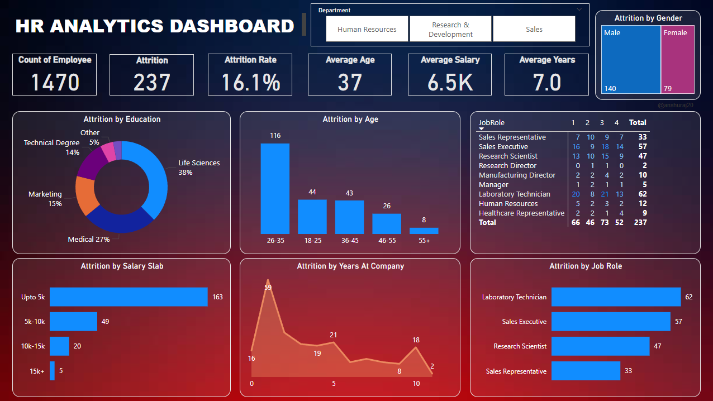

# 📊 HR Analytics Dashboard (Power BI Project)

## 🎯 Objective  
The goal of this project is to help an organization **improve employee performance** and **reduce attrition (increase retention)** by building an interactive **HR Analytics Dashboard** using Power BI.  

---

## 📂 Project Details  
- **Dataset**: `HR_Analytics.csv` (contains employee details such as demographics, performance, job roles, attrition, etc.)  
- **Tool Used**: Power BI Desktop  
- **Language/Queries**: DAX (for measures and KPIs)  

---

## 📌 Scope of Project  
The dashboard provides insights into:  
1. **Employee Overview** – Total employees, active employees, attrition count  
2. **Attrition Analysis** – By department, age, gender, salary slab, and education  
3. **Performance Tracking** – Performance ratings and training participation  
4. **Retention Metrics** – Average tenure, absenteeism, promotion trends  
5. **Demographics** – Gender ratio, job role distribution, and diversity metrics  

---

## 📊 Key Performance Indicators (KPIs)  
- **Total Employees**  
- **Attrition Count**  
- **Attrition %**  
- **Average Tenure**  
- **Employee Satisfaction Score**  
- **Training Participation Rate**  
- **Performance Distribution**  
- **Absenteeism Rate**  

---

## 📸 Dashboard Overview  

---

## 🔑 Key Insights  
- Higher attrition observed in specific job roles and departments.  
- Attrition trends influenced by **salary slab, age group, and performance rating**.  
- Training participation linked to higher performance ratings.  
- Average tenure varies significantly across departments, highlighting retention issues.  

---

## 🛠 Tools & Technologies  
- **Power BI Desktop** (Data visualization & dashboard creation)  
- **Excel/CSV** (Dataset storage)  
- **DAX** (Custom measures for KPIs)  

---

## 📖 Learning Source  
This project was developed by following the YouTube tutorial:  
👉 [Power BI Project End to End | Dashboard](https://youtu.be/j4xlVLgsmNQ?si=ub8F2xLspiPsZl6O) by **Rishabh Mishra** 
👉 [Github](https://github.com/rishabhnmishra)

---

## 🚀 How to Use  
1. Clone the repository.  
2. Open `powerbiproj.pbix` in **Power BI Desktop**.  
3. Load the dataset `HR_Analytics.csv` if not already connected.  
4. Explore the dashboard and apply filters for deeper insights.  

---

## 📌 Author  
**Anshu Raj**  
- GitHub: [anshuraj20](https://github.com/anshuraj20)  
- LinkedIn: [linkedin.com/in/anshuraj20](https://www.linkedin.com/in/anshuraj20/)  
